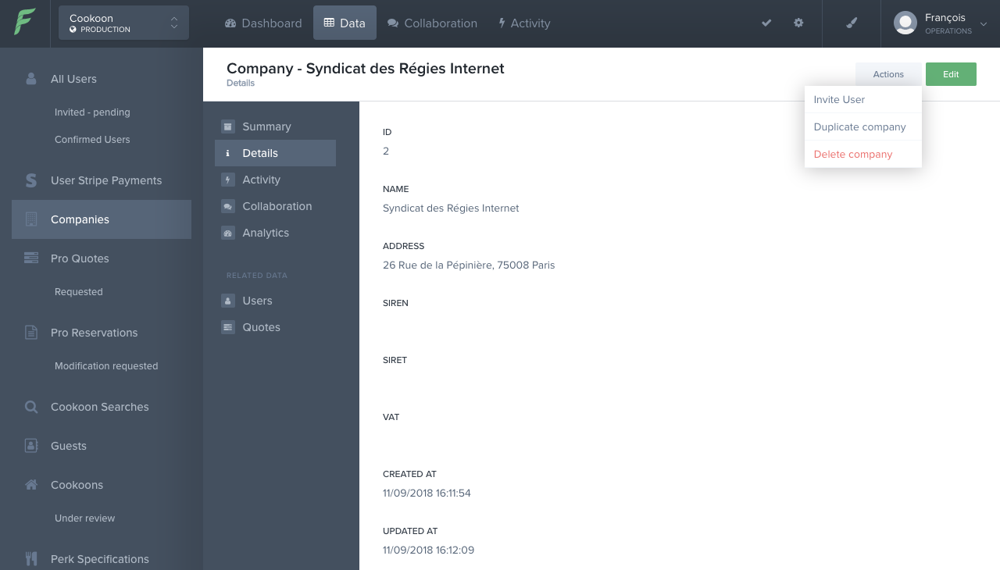
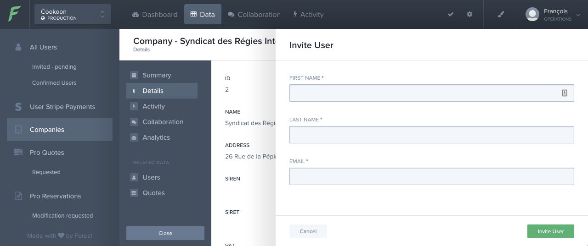

# Inviter un utilisateur pro

### Actions

1. Créer une Company si elle n'existe pas encore

2. Inviter l'utilisateur

- Utiliser l'action **Invite User** depuis la Company

- Renseignez les nom, prénom et email de votre invité

### Côté utilisateur

- L'invité reçoit un mail avec son lien pour accepter l'invitation. Contrairement à l'utilisateur non pro, le lien ne redirige pas vers l'application mobile.

- Une fois que l'utilisateur a accepté son invitation et renseigné son mot de passe, il est redirigé vers la page d'accueil de Cookoon pro.
