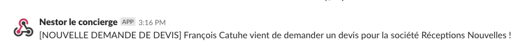
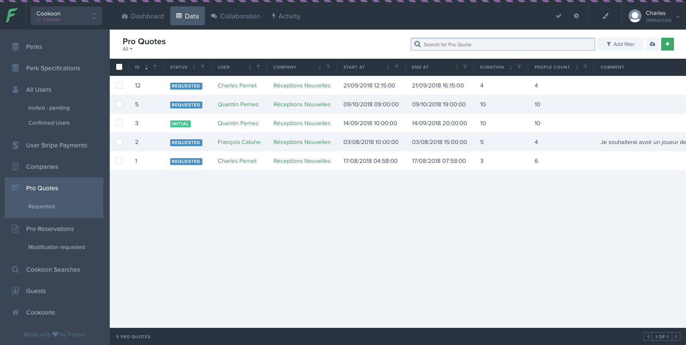
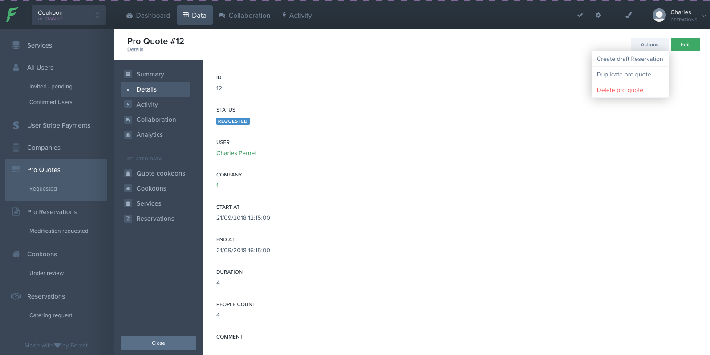
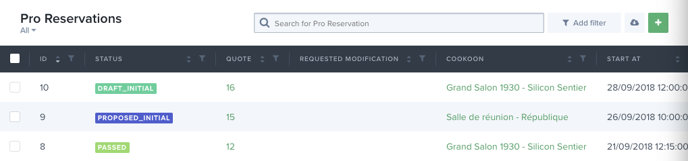
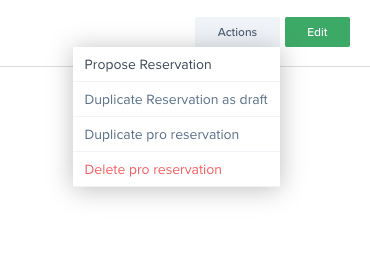
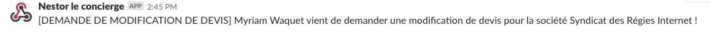
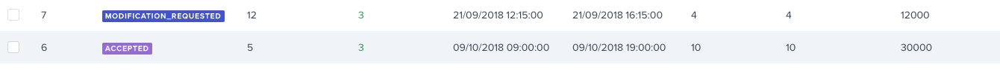
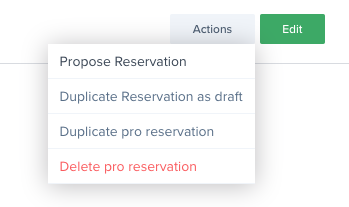
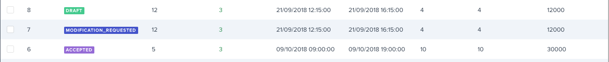

# Réception d'une nouvelle demande de devis

### Actions
  1. Se connecter à Forest Admin
  - Se rendre sur la page de la demande

    `Data(1) > Pro Quotes(2)`

    

  - cliquer sur une demande de devis (Pro Quote)

  - s'assurer d'être sur l'onglet 'détails'

  - cliquer sur 'Actions' > 'Create Draft Reservation'

  

  - Se rendre sur 'Pro Reservations', le devis créé devrait se trouver en haut de la liste avec le status 'Draft'

  

  - éditer la proposition et/ou ajouter des services

  - Une fois la proposition construite, cliquer sur 'Actions' > 'Propose Réservation'

  _Cela a pour effet de passer la proposition en status 'proposed' + d'envoyer un mail au client._

  __Attention : Ne pas éditer le status de la réservation, car le mail de notification ne partirais pas.__

  

### Fin du premier cycle
Le client a reçu un mail avec sa proposition

# Réception d'une demande de modification

 

### Actions

 1. Se rendre à nouveau dans l'espace Admin sur 'Pro Reservations'
La réservation a maintenant le status `modification_requested`

         

  __Attention il ne faut pas éditer cette reservation mais en créer une autre avec l'action 'Duplicate Reservation as Draft'__

  

 - Retourner sur l'index des propositions ('Pro Reservations')

  la nouvelle proposition apparait alors au dessus avec à nouveau le status 'Draft'

  

Le process reprend alors à l'etape 2?, éditer la proposition jusqu'à satisfaction ensuite cliquer sur 'Actions' > 'Propose Réservation'
